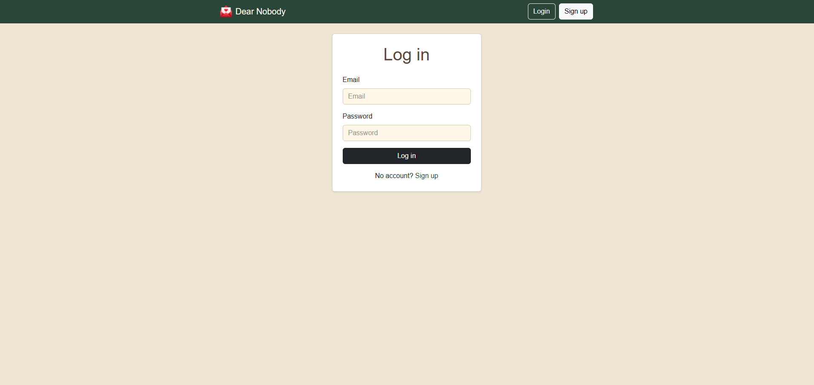
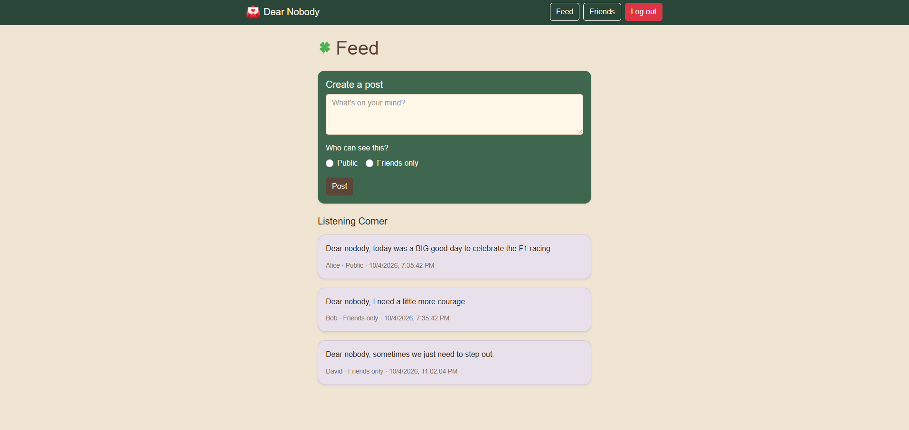
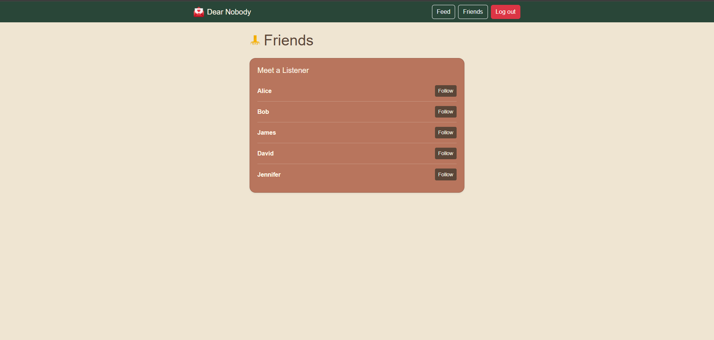

#  Dear Nobody

**A Place to Share Your Thoughts**

Dear Nobody is a social media built with React and connected to a hosted Express API. Users can create posts, control post visibility, and connect with friends.

Image 1: Login page.

Image 2: Feed page.

Image 3: Friends page.

## Frontend Base URL

https://dear-nobody.vercel.app/

## Features

- User signup
- User login
- JWT authentication
- Protected routes
- Create posts
- Public posts
- Friends-only posts
- View social feed
- Add friends
- Logout
- API error handling

## Tech Stack

- React
- JavaScript
- React Router
- Bootstrap
- Express
- PostgreSQL
- Supabase
- Railway
- Vercel

## API Endpoints

| Method | Endpoint | Description |
|---|---|---|
| POST | `/signup` | Create a new user |
| POST | `/login` | Log in and receive JWT |
| GET | `/users` | Get all users |
| POST | `/friends` | Add a friend |
| GET | `/posts` | Get accessible posts |
| POST | `/posts` | Create a post |

## API Base URL

https://dear-nobody-api-production.up.railway.app

## Authentication

The frontend uses **JWT authentication** for protected API requests.

The authentication token is stored in local storage and automatically included in protected requests.

## Post Visibility

Users can create:

- **Public** posts
- **Friends-only** posts

The feed displays posts based on the user's authentication and friendship access.

## Error Handling

The frontend handles common API errors including:

- Invalid login
- Duplicate username or email
- Missing required fields
- Invalid authentication token
- Invalid friend
- Invalid post visibility
- API request errors

## Deployment

- Backend API: Railway application
- Database: Supabase PostgreSQL
- Frontend: Vercel application

## Testing

The frontend was tested with the main user flows, including:

- User signup
- User login
- Protected pages
- Creating public posts
- Creating friends-only posts
- Adding friends
- Viewing the feed
- Logout